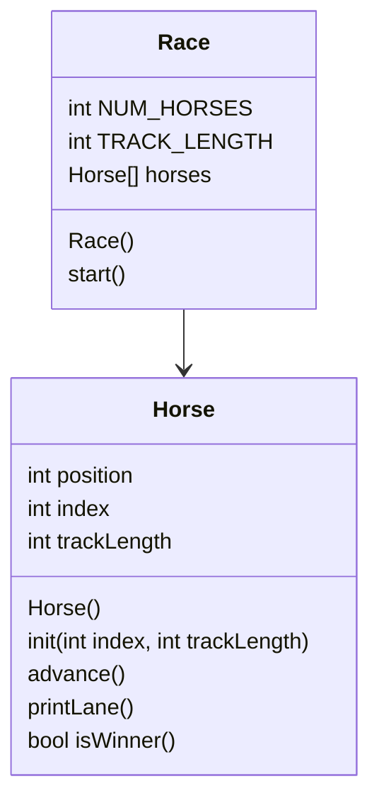

## Horse::Horse()

```
set position to 0
set index to 0
set trackLength to 15
```


## void Horse::init(int index, int trackLength)
```
set position to 0
set Horse::index to index
set Horse::trackLength to trackLength
```

## void Horse::advance()
```
assume random generator is seeded 
Roll a random 0 - 1 store in int coin
add coin to position, put result back in positon
```


## void Horse::printLane()

```
make for loop, pos goes from 0 to trackLength
    if pos == Horse::position:
        print Horse::index
    otherwise:
        print '.'
After loop, print a newline
```

## bool Horse::isWinner()

```
bool result = false

if position >= trackLength:
    result = true
    print some commentary

return result
```

## Race::Race()

```
const static int NUM_HORSES = 5
const int TRACK_LENGTH = 15

seed random generator

initialize the horses array

for each horse:
    initialize with index and trackLength
```

## void Race::start()

```
bool keepGoing = true

while keepGoing:
    for each horse:
        advance that horse
        print its lane

        if it is the winner:
            set keepGoing to false
```
